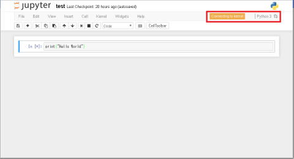
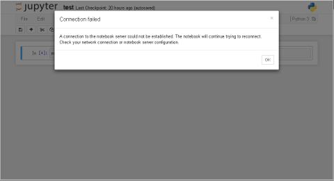

# Jupyter Notebook on OpenShift using the DIY cartridge (WIP)

## FUATURE

* Python 3.5.2
* Jupyter Notebook
    * IPython Widgets
    * Jupyter Notebook Extensions
* Numpy
* Scipy
* Matplotlib
* Pandas
* Networkx

## SERIOUS PROBLEMS TO SOLVE

* Cannot connect to the IKernel

